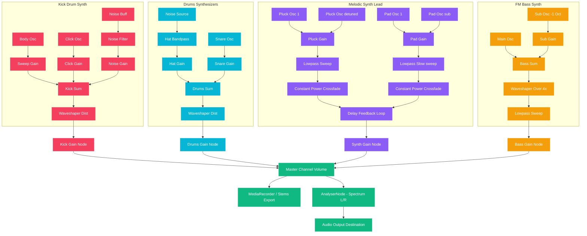

# 🎛️ Groovinator — 8-Beat Multi-Preset Loop Generator

[](https://developer.mozilla.org/en-US/docs/Web/API/Web_Audio_API)
[](https://developer.mozilla.org/en-US/docs/Web/API/Web_MIDI_API)
[](https://web.dev/progressive-web-apps/)
[](https://tailwindcss.com)
[](https://stuk.github.io/jszip/)

**Groovinator** is a premium, professional-grade, browser-based Progressive Web App (PWA) step sequencer and loop generator designed for live electronic music performance, sound design, and studio production. Built entirely on vanilla HTML5 and JavaScript using the low-latency **Web Audio API**, it offers comprehensive subtractive, FM, and additive synthesis engines directly in the browser—with absolutely zero external plugins required.

Integrating robust bidirection **Web MIDI** support, live WAV/WebM recording, multi-track dry stem exports, and offline-first PWA caching, Groovinator bridges the gap between lightweight web instruments and heavy-duty music hardware.

---

## ✨ Features & Capabilities

### 1. 🎚️ Dynamic 4-Track Synthesis Engine
Groovinator features four specialized sound generators built from native Web Audio nodes:

*   **Kick Drum (Track 1):** A punchy 909-style kick drum synthesizer. Combines a pitch-sweeping sine/triangle oscillator (pitch dropping exponentially from high frequency to sub-bass) with a transient click beater, noise burst, and a waveshaper distortion curve for high-intensity clipping.
*   **Drums (Track 2):** Synthesizes metallic open/closed hi-hats and punchy electronic snares using highpass/bandpass-filtered white noise and swept sine waves, creating snappy, high-fidelity cyber-percussion.
*   **Melodic Synth Lead (Track 3):** A dual-generator polyphonic lead synth that features constant-power crossfaded **Pluck** and **Pad** layers. 
    *   *Pluck Layer:* Dual detuned oscillators (sawtooth/square/sine) with a fast exponential lowpass filter envelope and a feedback delay loop.
    *   *Pad Layer:* Slow-attack, evolving waveforms with a secondary sub-oscillator pitched down an octave, slow filter sweeps, and smooth decay envelopes.
    *   *Pluck/Pad Morph Slider:* Seamlessly blends between pluck and pad textures using crossfading trigonometry.
*   **FM Bass (Track 4):** A sub-heavy, raw bassline synthesizer. Layers a main carrier oscillator (saw/square/triangle) with an independent sub-oscillator pitched exactly one octave down. Features a resonant lowpass filter envelope (decay sweep) and a distortion waveshaper for raw grit.

### 2. 🎛️ Interactive 8-Beat (32-Step) Sequencer
*   **High-Resolution Patterns:** Sequence complex grooves at a sixteenth-note resolution, spreading across 32 individual steps (8 beats in $4/4$ time).
*   **16-Level Track Intensity Bars:** Each track has an interactive intensity slider. Dragging this value (1 to 16) feeds custom generation algorithms that dynamically build rhythmically and melodically complex loops on the fly based on the chosen intensity level.
*   **Dynamic Scale-Locking:** The Synth and Bass tracks support automatic locking to professional music scales, including **Minor Pentatonic, Major, Blues, Natural Minor, Dorian, and Mixolydian**.
*   **Custom Preset Management:** Save, load, and delete specific pattern and sound parameters per instrument using local storage. 
*   **Global Master Presets:** Instantly load full soundscapes across all four tracks with curated styles for **Techno, House, and Trance**.

### 3. 🎹 Dual MIDI Power (Input, Output, & Hardware Mapping)
*   **Low-Latency Web MIDI API:** Direct integration with MIDI keyboards, drum pads, and controllers.
*   **Interactive MIDI Routing Modes:**
    *   *4-Channel Mixer Mode:* Maps individual MIDI channels 1-4 directly to Kick, Drums, Synth, and Bass.
    *   *Omni Keyboard Mode:* Splits a single keyboard layout—playing lower register keys triggers the FM Bass, while upper registers trigger the Synth Lead Plucks.
*   **MIDI Out & Sync:**
    *   Transmit generated sequences to external DAWs or hardware synthesizers.
    *   **MIDI Clock Sync:** Outputs standard MIDI Real-time Messages (Start `0xFA`, Stop `0xFC`, and Clock Ticks `0xF8` at 24 PPQN) to synchronize external sequencers and hardware drum machines.
*   **🎛️ Traktor Kontrol S3 & S2/S4 Integration:**
    Pre-mapped out-of-the-box for Native Instruments DJ controllers in standard MIDI mode. Layout mimics a 4-deck physical mixer in **C-A-B-D** order (left-to-right):
    *   *Deck C (Kick) / Deck A (Drums) / Deck B (Synth) / Deck D (Bass)*
    *   *Volume Faders (CC 1):* Channel Volume.
    *   *Filter Knobs (CC 4):* Real-time Step Intensity (1–16).
    *   *Low EQ (CC 5):* Tuning / Decay Lengths.
    *   *Mid EQ (CC 6):* Filter Cutoffs / Tone Sweeps.
    *   *High EQ (CC 7):* Transient Click / Snappy Noise Levels.
    *   *Gain Knobs (CC 8):* Distortion Drive.
    *   *Buttons:* `ON` maps to Track Mute, `CUE` maps to Track Solo.

### 4. 🎚️ Production & Export Tools
*   **Live Stereo Recorder:** Capture your master mix in real-time, exporting either to a compressed **WebM** or lossless, studio-grade **WAV** format.
*   **Multi-Track Stem ZIP Export:** Record individual dry audio stems for all four tracks simultaneously. Groovinator packages them into separate `.wav` files and compresses them into a single **ZIP** archive using **JSZip**, ready to be dropped into Ableton, Logic, or FL Studio.
*   **Stereo Visualizer Canvas:** A highly responsive frequency spectrum analyzer displaying real-time stereo waveforms with discrete Decibel (dB) Peak Level Meters for Left and Right channels.

### 5. 📱 PWA Fullscreen HUD
*   **Offline-First Operation:** Service Worker registers and caches all static HTML, scripts, external libraries, and brand icons, allowing the app to run completely offline without an internet connection.
*   **Standalone Installable Shell:** Prompts to install as a standalone app on macOS, Windows, iOS, and Android, hiding browser chrome to provide a sleek, dark-mode, hardware-style dashboard.

---

## 📐 Technical Architecture & Audio Signal Flow

Groovinator is designed around a single-context, multi-node routing architecture inside the Web Audio API. Below is the simplified audio routing graph of the system:



---

## 📂 Project Directory Structure

```bash
groovinator/
├── index.html          # Core single-page app containing layout, Tailwind config, and Web Audio/Sequencer logic
├── service-worker.js   # Service Worker script managing static cache strategies for offline execution
├── manifest.json       # Progressive Web App manifest defining standalone display details and icons
├── icon-192.png        # Medium-resolution PWA launcher icon (192x192)
├── icon-512.png        # High-resolution PWA launcher icon (512x512)
└── README.md           # Technical documentation and product manual
```

---

## 🚀 Local Development & Deployment

Since Groovinator is a pure static web application, it doesn't require any build steps or database setups. However, because Web Workers, Service Workers, and Web Audio API are restricted by browser security policies under specific file contexts, **you must serve the project folder using a local HTTP server** instead of double-clicking `index.html`.

### 1. Launch a Local Server
Choose any of the following fast commands in your terminal from the root of the project:

**Using Node.js (http-server):**
```bash
npx http-server -p 8080
```

**Using Python:**
```bash
# Python 3.x
python3 -m http.server 8080

# Python 2.x
python -m SimpleHTTPServer 8080
```

**Using PHP:**
```bash
php -S localhost:8080
```

### 2. Access the Application
Open your web browser (Chrome, Edge, or Opera are highly recommended for optimal Web MIDI and Web Audio performance) and navigate to:
```
http://localhost:8080
```

---

## 🎹 Quick Hardware Integration Guide

To connect a DJ controller (e.g. Traktor Kontrol S3):
1.  **Toggle MIDI Mode:** Switch your controller out of its proprietary protocol into standard, class-compliant MIDI mode:
    *   **Direct Hardware Boot Method:** Remove the power plug, hold down the **`FLX`** button, and connect the controller to the computer.
    *   *Alternative S3/S4 Method:* Press and hold `SHIFT` + `EXT` (Deck Select) or `SHIFT` + `BROWSE` on the controller.
2.  **Enable MIDI inside Groovinator:** Click the **MIDI** button in the header of the app to open the configuration panel.
3.  **Choose Routing:** Toggle **4-Channel Mixer Mode** or **Omni Keyboard Mode**.
4.  **Confirm Input:** Move any fader on your controller and inspect the **Live MIDI Input Monitor** in the HUD to verify messages are flowing.

---

## 🛡️ License

This project is open-source and available under the [MIT License](LICENSE). Built for music creators, electronic live performers, and web audio engineers. Enjoy grooving! 🎧🔥
